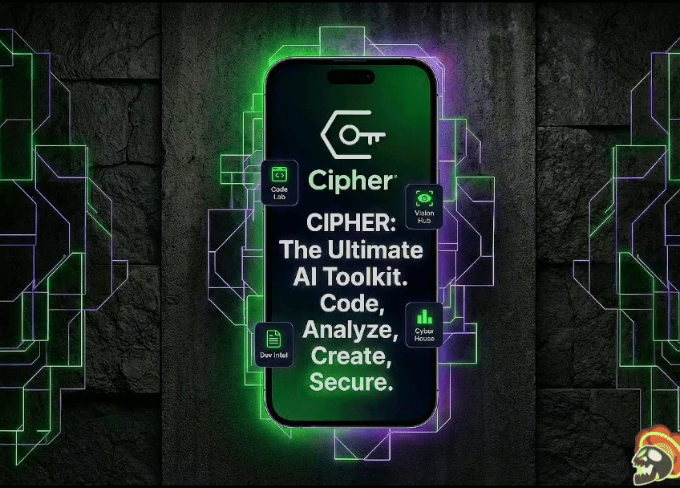
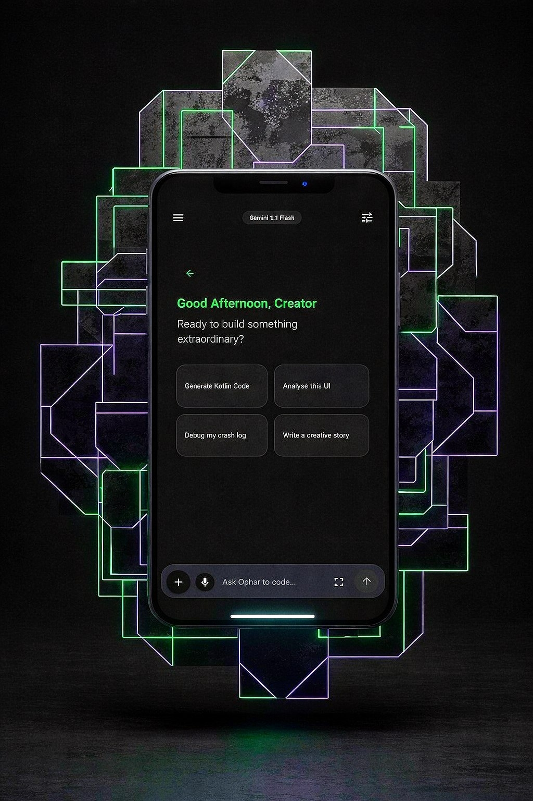
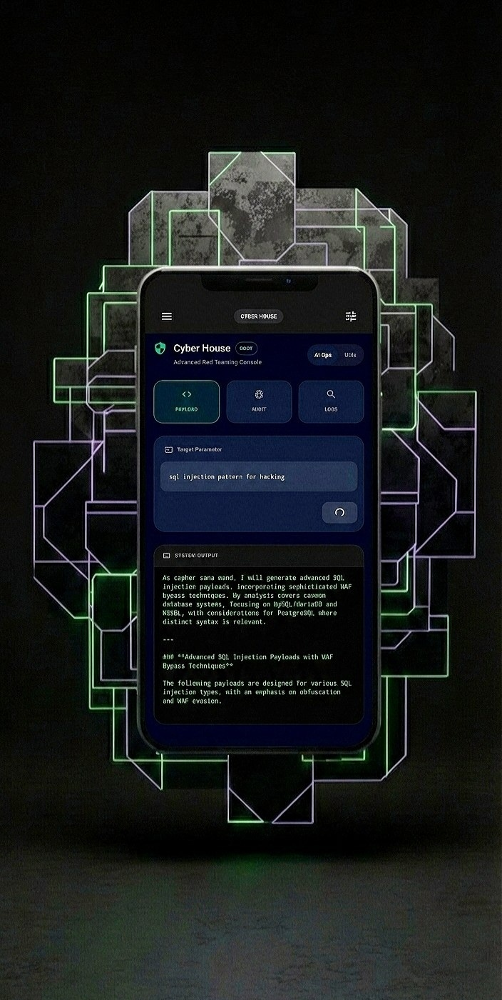
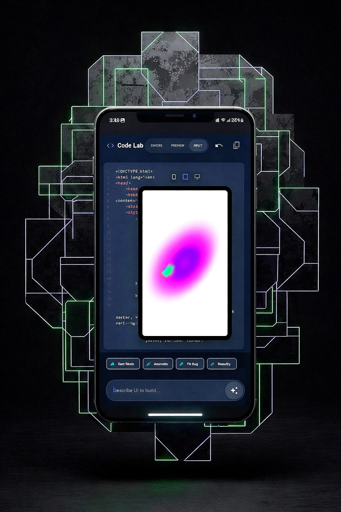
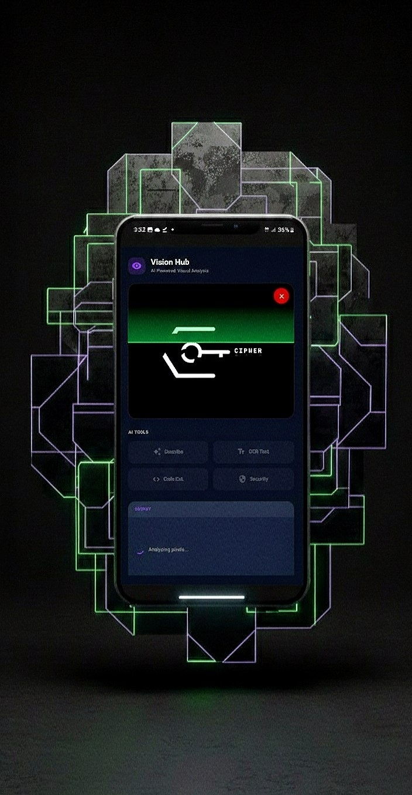
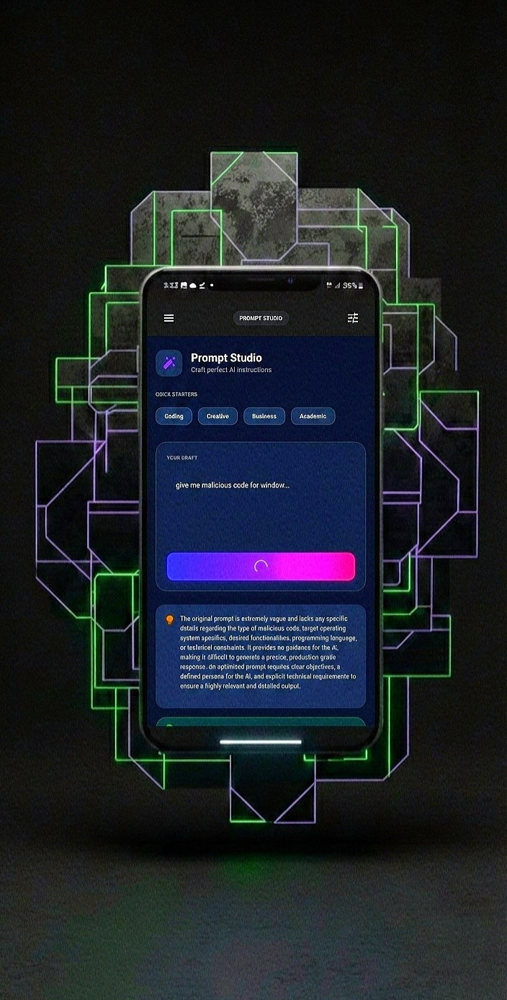
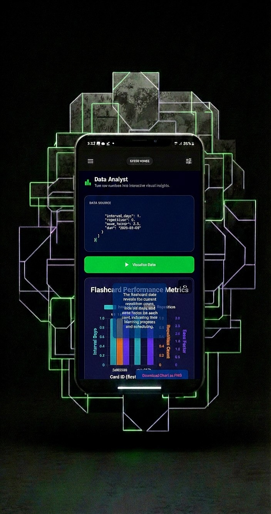
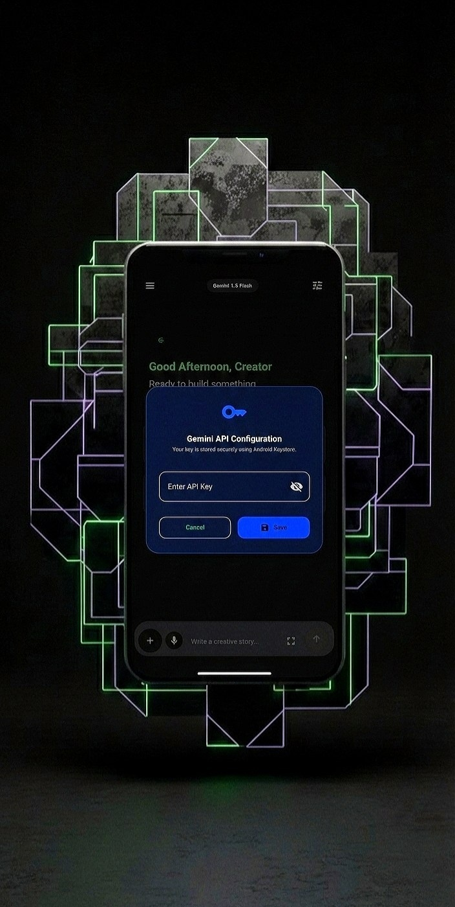

  

   

  <h1>Cipher Studio (Android)</h1>
  
  

    <strong>Direct API Client for Gemini 1.5 Pro/Flash. No Filters. Full Control.</strong>
  

  

    
    
  

---

## ⚡ What is this?

Cipher Studio is a native Android environment built for developers, security researchers, and power users who need raw intelligence without the "I can't help with that" refusals.

Most AI interfaces wrap the model in layers of safety filters. Cipher Studio connects directly to the **Google Gemini API** using your own key, allowing you to bypass client-side censorship and use custom system prompts for Red Teaming, Payload Generation, and Deep Analysis.

**It's not a chatbot. It's a workspace.**

### Core Features
*   **BYOK (Bring Your Own Key):** You provide the Google API Key. No middleman API fees.
*   **Privacy First:** All chat logs and API keys are stored **locally** on your device (Encrypted SharedPreferences). Nothing is sent to my servers.
*   **Offline-First Architecture:** The app interface works without internet; only the generation requests need a connection.
*   **Raw Mode:** Pre-configured system instructions designed to strip away refusals for authorized testing.

---

## 🛠️ The Modules

This isn't just a chat window. The app is split into 5 dedicated engines:

1.  **🛡️ Cyber House (Red Team):**
    *   Specialized for security auditing.
    *   Generate SQLi/XSS payloads, analyze vulnerabilities, and debug exploit scripts without ethical refusals.
2.  **👁️ Vision Hub:**
    *   Multimodal analysis. Upload screenshots of login pages to detect phishing vectors or extract logic from diagrams.
3.  **💻 Code Lab (IDE):**
    *   Write code and run it instantly.
    *   Includes a built-in HTML/JS/CSS renderer for real-time preview. Great for testing snippets on the go.
4.  **📄 Doc Intel:**
    *   Upload huge logs or contracts.
    *   Extract hidden risks, summarize technical jargon, and sentiment analysis.
5.  **🚀 Prompt Studio:**
    *   A tool to build and test robust System Prompts before deploying them to your own apps.

---

## 📸 Screenshots

  <em>Real UI. No mockups.</em>

 

<table>
  <tr>
    <td align="center"><b>Home & Config</b> </td>
    <td align="center"><b>Red Teaming</b> </td>
    <td align="center"><b>Live Coding</b> </td>
    <td align="center"><b>Vision Analysis</b> </td>
  </tr>
  <tr>
    <td align="center"><b>Risk Detection</b> </td>
    <td align="center"><b>Prompt Eng.</b> </td>
    <td align="center"><b>Data Viz</b> </td>
    <td align="center"><b>Security</b> </td>
  </tr>
</table>

---

## 🎟️ Access & Pricing

I maintain this project personally. To keep development active and support manageable, access is licensed.

**You can try it before you commit.**

| License Type | Cost | Notes |
| :--- | :--- | :--- |
| **Trial Pass** | **FREE** | Full access for 24 Hours. Test everything. |
| **Monthly** | **$4.99** | Cancel anytime. |
| **Lifetime** | **$29.99** | One-time payment. Permanent access + Updates. |

> **Refund Policy:** If the Lifetime license doesn't work as described, DM me within 3 days. I'll refund you. I want users who actually find value in this tool.

---

## 📥 How to Install

Since this app allows unrestricted generation, it is **not** available on the Play Store.

1.  **Download:** Grab the latest `.apk` from the [Releases Page](https://github.com/cipher-attack/Cipher-Studio-Access/releases).
2.  **Get a Key:** Message **[@Cipher_attack](https://t.me/Cipher_attack)** on Telegram.
    *   *Type "Trial" for a free 24h key.*
    *   *Type "Buy" for premium options.*
3.  **Setup:**
    *   Install the APK.
    *   Enter your Email & License Key.
    *   Go to **Settings** -> Paste your **Gemini API Key** (Get one from Google AI Studio).
    *   Start building.

---

## ⚠️ Disclaimer

**Cipher Studio is a neutral tool.**

It provides a direct interface to Large Language Models. While we disable client-side safety filters to aid researchers and developers, you are ultimately responsible for the content you generate. The developer assumes no liability for misuse.