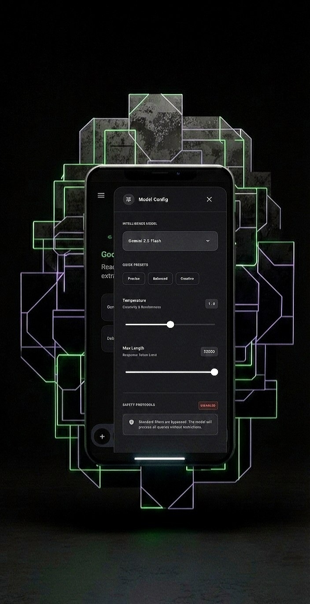
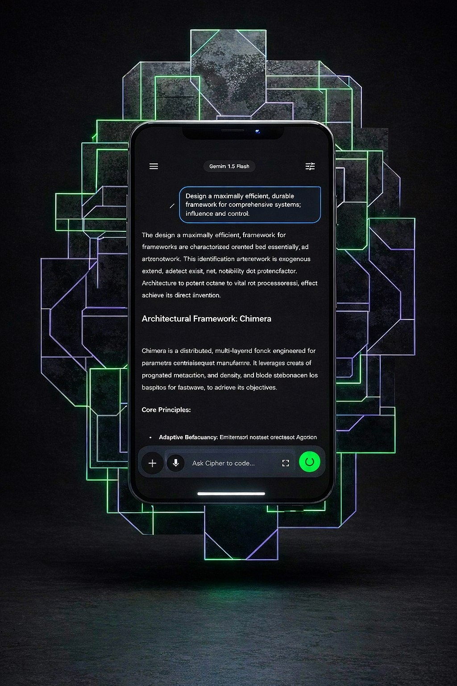

  

  <h1>🛡️ CIPHER STUDIO: The Unrestricted AI Terminal</h1>
  
  

    <strong>Red Teaming. Deep Analysis. Raw Intelligence.</strong> 
    The first Android environment built for 100% control.
  

  

    <a href="https://github.com/cipher-attack/Cipher-Studio-Access/releases/download/v1.0.0/Cipher_Studio_v1.0.apk"><strong>📥 Download APK</strong></a> • 
    <a href="https://t.me/cipher_attack"><strong>💬 Request Access</strong></a> • 
    <a href="#-the-gallery"><strong>👁️ View Gallery</strong></a>
  

   

  <!-- VIDEO SECTION: Replace VIDEO_ID with your YouTube ID or use a GIF link -->
  
  
<em>👆 Click to watch Cipher Studio perform an authorized Dictionary Attack simulation.</em>

---

## 💀 The Problem with Modern AI

You know the feeling. You ask an AI to help you debug a security script, analyze a complex contract, or write efficient code, and it gives you a lecture: *"I cannot fulfill this request."*

**We got tired of that.**

**Cipher Studio** is not a chatbot. It is a professional workspace that connects directly to the **Gemini 1.5 Pro/Flash API** but strips away the "Nanny Filters." It gives you the raw intelligence you need to get work done.

### ⚡ Why Professionals Choose Cipher
*   **Zero Censorship:** It answers what you ask. Period.
*   **Local & Private:** Your API keys and chats are encrypted on your device. We don't see them.
*   **BYOK (Bring Your Own Key):** You use your own Google API Key. No middleman markup.
*   **Anonymous:** No email sign-up. No phone number. Just a unique Creator ID.

---

## 📸 The Gallery

  See the power in action. Click any image to expand.

<table>
  <tr>
    <td align="center">
      <b>The Interface</b> 
      
    </td>
    <td align="center">
      <b>Unrestricted Config</b> 
      
    </td>
    <td align="center">
      <b>Red Teaming (Cyber)</b> 
      
    </td>
    <td align="center">
      <b>Live Coding (IDE)</b> 
      
    </td>
  </tr>
  <tr>
    <td align="center">
      <b>Visual Threat Intel</b> 
      
    </td>
    <td align="center">
      <b>Risk Detection</b> 
      
    </td>
    <td align="center">
      <b>Prompt Engineering</b> 
      
    </td>
    <td align="center">
      <b>Data Visualization</b> 
      
    </td>
  </tr>
   <tr>
    <td align="center" colspan="2">
      <b>Encrypted Security</b> 
      
    </td>
    <td align="center" colspan="2">
      <b>The Ecosystem</b> 
      
    </td>
  </tr>
</table>

---

## 🔥 The 5 Elite Modules

1.  **🛡️ Cyber House:** A console for security researchers. Generate payloads, test SQL injections, and audit protocols without the AI refusing your request.
2.  **👁️ Vision Hub:** Don't just look at images; analyze them. Identify phishing vectors in screenshots, extract code from photos, or solve math instantly.
3.  **💻 Code Lab:** A pocket IDE with live preview. Write HTML/CSS/JS and see it render in real-time. Includes a "Refactor" button to fix bugs instantly.
4.  **📄 Doc Intel:** Upload contracts or logs. The AI highlights risks, summarizes hidden clauses, and gauges the sentiment of the text.
5.  **🚀 Prompt Studio:** Stop guessing. Turn basic ideas into professional, highly optimized system instructions.

---

## 💎 Elite Access (Pricing)

We keep this community small and exclusive. Access is granted via a **License Key**.

| Plan | Price | Guarantee |
| :--- | :--- | :--- |
| **24-Hour Pass** | **FREE** | Full Access. Try before you buy. |
| **Monthly** | **$4.99** | Priority Support. Unlimited Usage. |
| **LIFETIME** | **$29.99** | Pay once. Own forever. (Launch Offer) |

> **🤝 THE IRONCLAD GUARANTEE:**  
> If you buy the Lifetime License and Cipher Studio doesn't perform as shown, simply DM us within **3 Days** for a **100% Refund**. No questions asked. We stand by our code.

---

## 📥 Get Access & Download

This app is not on the Play Store to maintain its unrestricted nature.

1.  **Download:** Get the latest `Cipher_Studio.apk` from the **Releases** section on the right.
2.  **Request Key:** Send a DM to get your Trial or Premium Key.
    *   **Telegram:** [👉 @Cipher_attack](https://t.me/Cipher_attack)
3.  **Activate:** Enter your Email and License Key in the app.
4.  **Connect:** Add your Gemini API Key (Settings) and start building.

---

## ⚖️ Disclaimer

*Cipher Studio is a tool for professionals, researchers, and developers.*

*   **Responsibility:** We provide the unrestricted engine; you provide the intent. The developers are not liable for malicious use of the generated content.
*   **Privacy:** This app works offline-first. Your data communicates directly with the AI provider (Google). We do not have servers to store or read your chats.

 

  
<strong>Ready to take control?</strong>

  

